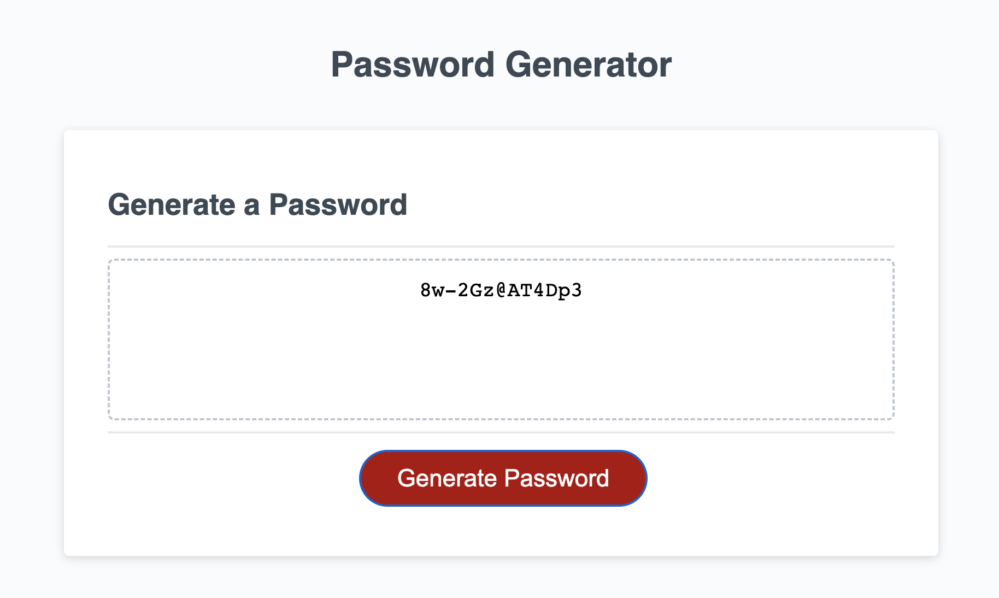

# challenge5-PasswordGenerator
 Challenge requires to create an application that an employee can use to generate a random password based on criteria they’ve selected by modifying starter code.

## Links

https://helloseva.github.io/challenge5-PasswordGenerator/

## Description 

This week’s Challenge as a part of the bootcamp required to create an application that an employee can use to generate a random password based on criteria they’ve selected by modifying starter code. I have created an app that runs in the browser and features dynamically updated HTML and CSS, all powered by JavaScript code. The task was to write JavaScript code for genereted random password to include each of the following:

- Generate a password when the button is clicked.
- Present a series of prompts for password criteria such as Length of password which is at least 10 characters but no more than 64; Lower and UpperCase characters, numeric and special characters
- Once all prompts are answered, the password should be generated and displayed in an alert or written to the page.

In this task I used variables, prompts, function, arrays, if statements.

## Table of Contents (Optional)

* [Installation]
* [Usage]
* [License]

## Installation

1. Go To https://github.com/helloseva/challenge5-PasswordGenerator 
2. Copy the Git clone link using SSH.
3. In terminal on your local device, clone the repository using Git clone.
4. Open in Visual Studio.

## Usage 

This page is about using basic JavaScript skills to create a financial analysis tool. It can be used to have a look at basic concepts of JS. 

Screeshot of the Web Page:

## Credits

N/A

## License

Please refer to the LICENSE in the repo.
